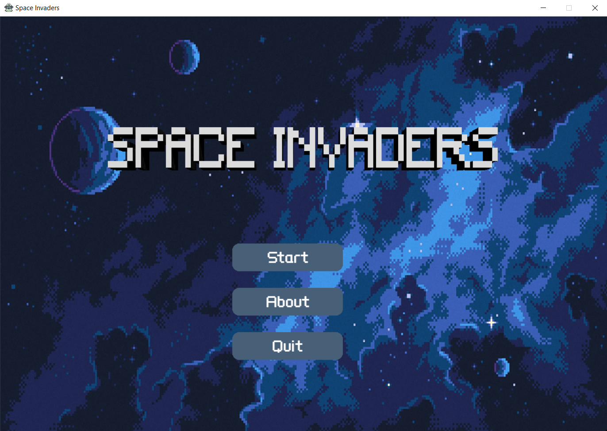
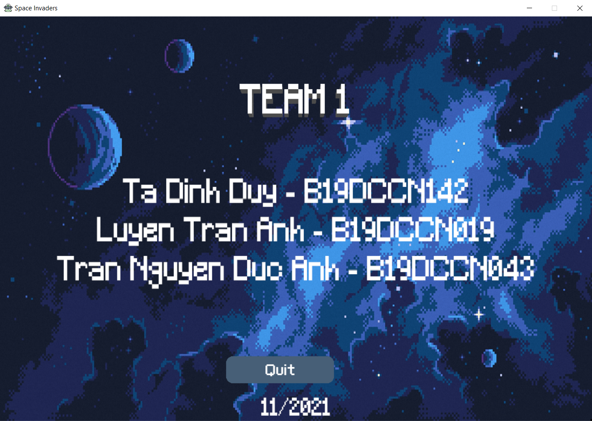
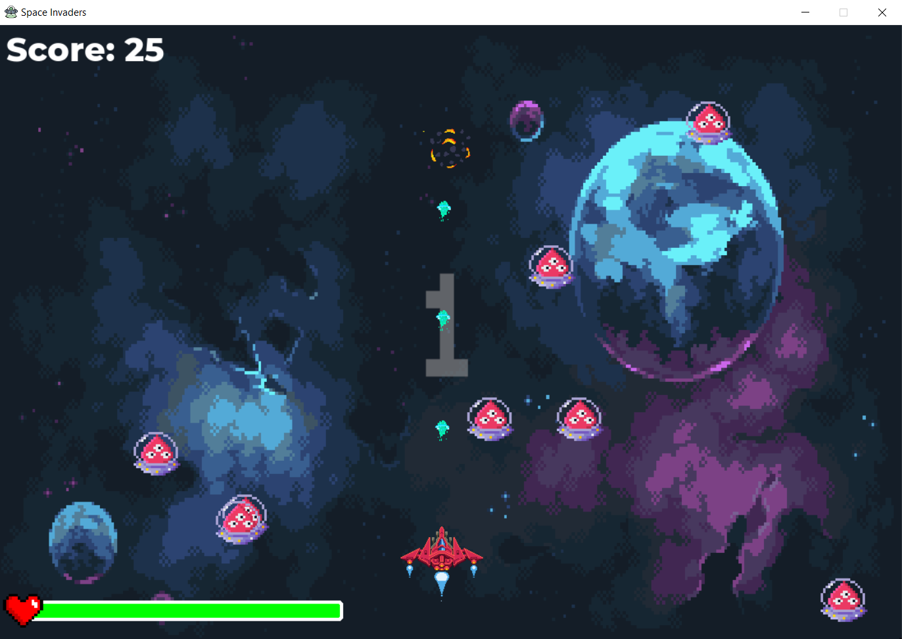
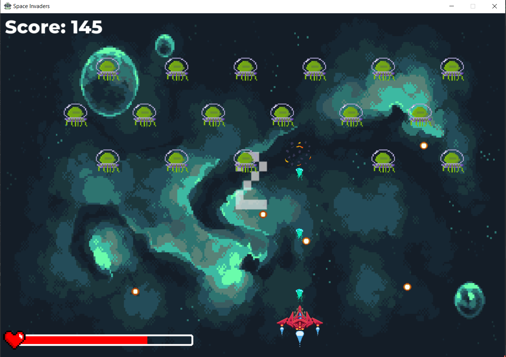
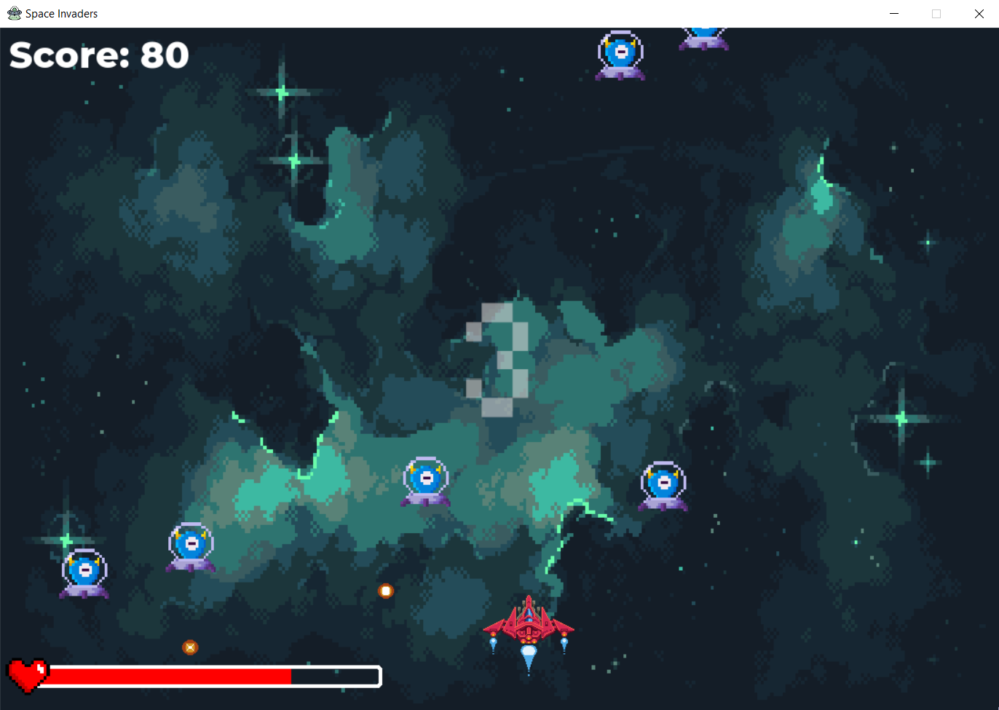
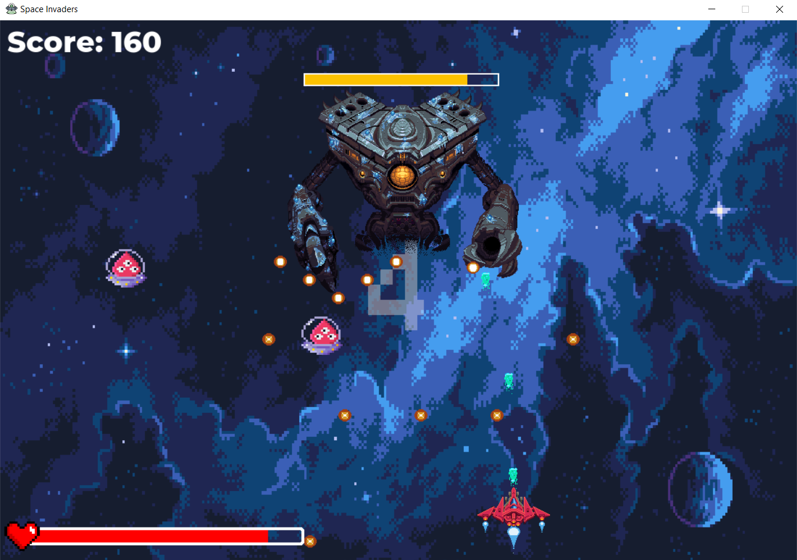

# Game Space Invaders

Space Invaders is a pixel space shooter game using python pygame.



This repository contains the source code and the assets for 
the game I made in two week.

## Environment
```shell script
OS: Windows10
Python: Python3.8
Pygame: 2.0.1
```

## Statement
```
Most of the game materals (including music, fonts and pictures) in this game
are collected from the web, copyright belongs to the original author. This 
repository is created just for learning python.
```
## Features

Game features:
- 3 different enemies 
- 1 boss
- 4 levels
- Button
- Health bar
- Power-up
- P to pause

About my team


Level 1


Level 2


Level 3


Boss


